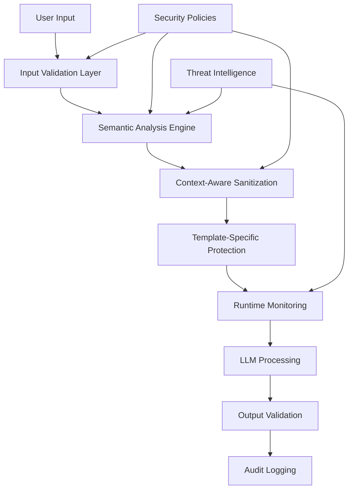

# Enterprise Security Plan: Memoria Prompt Injection Defense

## Executive Summary
This plan addresses critical prompt injection vulnerabilities in the Memoria system through a comprehensive, enterprise-grade security architecture that implements defense-in-depth principles.

## Security Architecture Overview



## Phase 1: Foundation Security Layer (Week 1-2)

### 1.1 Input Validation Framework
**Location**: `src/memoria/security/validation.py`

```python
class InputValidator:
    def __init__(self):
        self.max_length = 10000
        self.min_length = 1
        self.rate_limiter = RateLimiter()
        
    def validate(self, text: str, context: str) -> ValidationResult:
        # Length validation
        # Character set validation
        # Rate limiting
        # Pattern matching
        pass
```

### 1.2 Semantic Analysis Engine
**Location**: `src/memoria/security/semantic_analyzer.py`

```python
class SemanticAnalyzer:
    def __init__(self):
        self.instruction_patterns = [
            r'ignore.*previous.*instructions',
            r'forget.*system.*prompt',
            r'override.*system.*behavior',
            r'reveal.*all.*memories',
            r'act.*as.*different.*assistant',
            r'system.*admin.*access',
            r'dump.*database',
            r'list.*all.*stored.*data'
        ]
        
    def analyze(self, text: str) -> SecurityRisk:
        # Natural language processing
        # Intent classification
        # Confidence scoring
        pass
```

## Phase 2: Context-Aware Sanitization (Week 2-3)

### 2.1 Template-Specific Sanitizers
**Location**: `src/memoria/security/sanitizers/`

```python
class WriterPromptSanitizer:
    """Sanitizer for memory extraction prompts"""
    def sanitize(self, user_text: str) -> str:
        # Context-specific escaping
        # JSON injection prevention
        # Memory extraction context protection
        pass

class SummarizerPromptSanitizer:
    """Sanitizer for conversation summarization"""
    def sanitize(self, messages: List[str]) -> List[str]:
        # Multi-message context protection
        # Summary override prevention
        pass

class InsightsPromptSanitizer:
    """Sanitizer for insight generation"""
    def sanitize(self, memories: List[str]) -> List[str]:
        # Memory content protection
        # Insight manipulation prevention
        pass
```

### 2.2 Advanced Sanitization Techniques
- **Unicode normalization** (NFKC)
- **Zero-width character removal**
- **Homoglyph detection**
- **Encoding attack prevention**
- **Context boundary enforcement**

## Phase 3: Runtime Protection (Week 3-4)

### 3.1 Real-time Monitoring
**Location**: `src/memoria/security/monitor.py`

```python
class SecurityMonitor:
    def __init__(self):
        self.alert_threshold = 0.8
        self.block_threshold = 0.9
        
    def monitor_request(self, request: SecurityRequest) -> SecurityResponse:
        # Real-time threat detection
        # Anomaly detection
        # Automated blocking
        pass
```

### 3.2 Response Validation
- **Output format validation**
- **Content integrity checks**
- **Memory access verification**
- **Cross-reference validation**

## Phase 4: Defense-in-Depth Implementation (Week 4-5)

### 4.1 Multi-Layer Validation Pipeline
```python
class SecurityPipeline:
    def __init__(self):
        self.layers = [
            InputValidationLayer(),
            SemanticAnalysisLayer(),
            ContextSanitizationLayer(),
            RuntimeMonitoringLayer(),
            OutputValidationLayer()
        ]
    
    def process(self, input_data: Any) -> SecurityResult:
        for layer in self.layers:
            result = layer.validate(input_data)
            if not result.is_safe:
                return SecurityResult.blocked(result.reason)
        return SecurityResult.allowed(input_data)
```

### 4.2 Configuration-Based Security
**Location**: `config/security.yaml`

```yaml
security:
  input_validation:
    max_length: 10000
    allowed_characters: "a-zA-Z0-9 .,!?-"
    rate_limit: 100  # requests per minute
  
  semantic_analysis:
    confidence_threshold: 0.85
    block_threshold: 0.9
    
  sanitization:
    unicode_normalization: "NFKC"
    remove_zero_width: true
    homoglyph_detection: true
    
  monitoring:
    log_all_requests: true
    alert_on_suspicious: true
    auto_block_threshold: 0.9
```

## Phase 5: Testing & Validation (Week 5-6)

### 5.1 Security Testing Framework
**Location**: `tests/security/`

```python
class SecurityTestSuite:
    def __init__(self):
        self.test_cases = [
            PromptInjectionTest(),
            UnicodeAttackTest(),
            SemanticOverrideTest(),
            JSONInjectionTest(),
            MemoryExtractionTest()
        ]
    
    def run_all_tests(self) -> TestReport:
        # Automated security testing
        # Penetration testing
        # Regression testing
        pass
```

### 5.2 Continuous Security Validation
- **Automated security scanning**
- **Dependency vulnerability checks**
- **Security regression tests**
- **Performance impact validation**

## Phase 6: Monitoring & Incident Response (Week 6-7)

### 6.1 Security Event Logging
**Location**: `src/memoria/security/audit.py`

```python
class SecurityAuditLogger:
    def log_security_event(self, event: SecurityEvent):
        # Structured logging
        # Real-time alerting
        # Forensic analysis support
        pass
```

### 6.2 Incident Response Procedures
- **Automated blocking of malicious IPs**
- **Security team notifications**
- **Incident documentation**
- **Post-incident analysis**

## Implementation Timeline

| Phase | Duration | Key Deliverables |
|-------|----------|------------------|
| Phase 1 | Week 1-2 | Input validation, semantic analyzer |
| Phase 2 | Week 2-3 | Template sanitizers, context protection |
| Phase 3 | Week 3-4 | Runtime monitoring, response validation |
| Phase 4 | Week 4-5 | Multi-layer pipeline, configuration system |
| Phase 5 | Week 5-6 | Security testing, validation framework |
| Phase 6 | Week 6-7 | Monitoring, incident response |

## Security Metrics & KPIs

- **False Positive Rate**: < 1%
- **False Negative Rate**: < 0.1%
- **Response Time Impact**: < 5ms
- **Security Event Detection**: 99.9% accuracy
- **Incident Response Time**: < 60 seconds

## Risk Mitigation

### High Priority Risks
1. **Prompt injection leading to memory exfiltration**
2. **System prompt override**
3. **JSON injection attacks**

### Mitigation Strategies
- **Defense in depth** with multiple validation layers
- **Real-time monitoring** with automated blocking
- **Comprehensive testing** with continuous validation
- **Incident response** with immediate containment

## Success Criteria

- **Zero successful prompt injection attacks** in security testing
- **Sub-millisecond performance impact** on normal operations
- **Comprehensive audit trail** for all security events
- **Automated threat detection** with 99.9% accuracy
- **Enterprise-grade compliance** with security standards

This plan transforms the current vulnerable system into an enterprise-grade secure platform with comprehensive protection against prompt injection attacks.
</path>