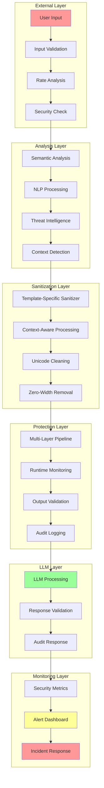
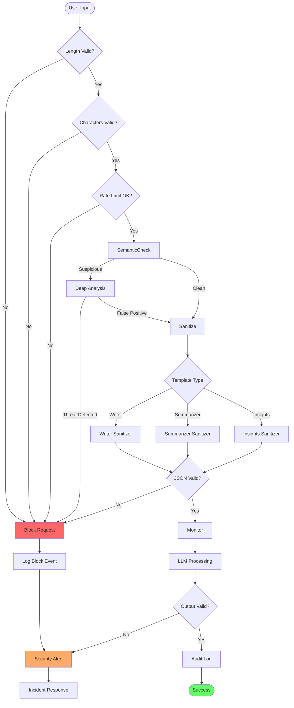
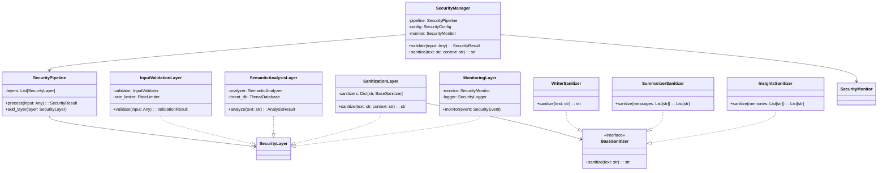
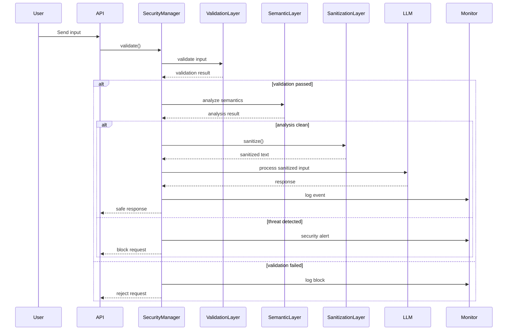
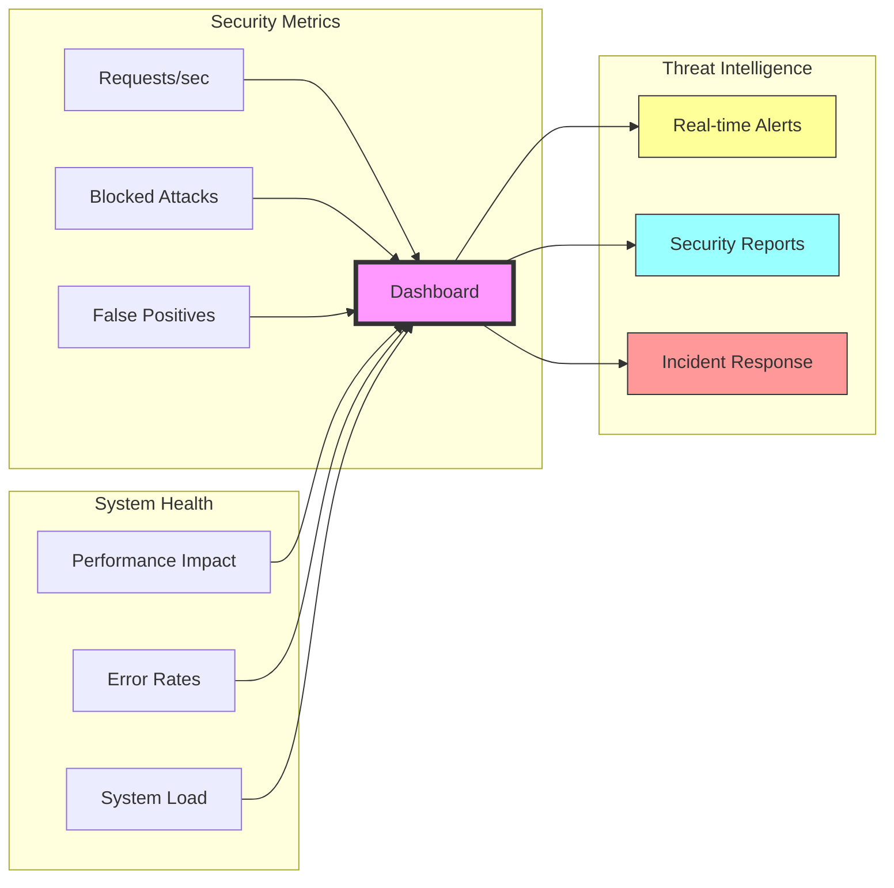

# Enterprise Security Architecture Diagram

## High-Level Security Flow



## Detailed Security Pipeline



## Security Component Architecture



## Data Flow Security



## Security Monitoring Dashboard



## Security Configuration Structure

```mermaid
graph TD
    subgraph "Security Config"
        SC[security.yaml] --> IV[Input Validation]
        SC --> SA[Semantic Analysis]
        SC --> SAN[Sanitization]
        SC --> MON[Monitoring]
        
        IV --> ML[max_length]
        IV --> AC[allowed_chars]
        IV --> RL[rate_limit]
        
        SA --> CT[confidence_threshold]
        SA --> BT[block_threshold]
        
        SAN --> UN[unicode_normalization]
        SAN --> ZW[zero_width_removal]
        
        MON --> LA[log_all]
        MON --> AT[alert_threshold]
    end